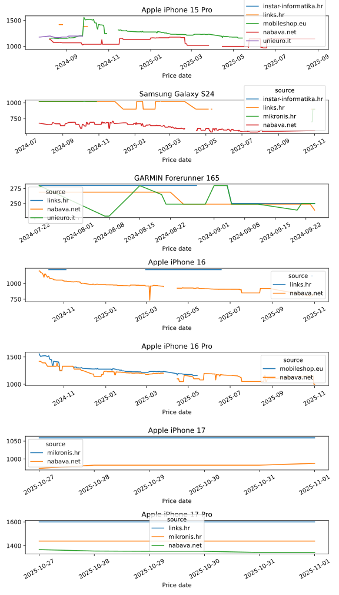

# Price Scraper

Scrapes prices for configured products. 

Inputs:

- path to `config.json` as a program parameter (`--config-json-path`)
- CSV output to a directory configured as an **environment variable** (`REPOSITORY_IO_PATH`)

Outputs:
- `${REPOSITORY_IO_PATH}`*/products.csv*

## Installation

Price Scraper is a Python package that is installed and ran via a Command Line. 

Perform the following commands to install the package:

    pip install git+https://github.com/andhrelja/price_scraper
    python -m price_scraper --help


## Usage

    usage: price_scraper [-h] [-i CONFIG_JSON_PATH]

    Scrape pre-configured websites for product prices

    options:
    -h, --help            show this help message and exit
    -i CONFIG_JSON_PATH, --config-json-path CONFIG_JSON_PATH
                            Products configuration input JSON absolute file path
    
    examples:
        python -m price_scraper -i /<absolute-path>/config.json

        python -m price_scraper --config-json-path /<absolute-path>/config.json


## Configuration 

> [!IMPORTANT]  
> Supported websites are listed as module names in `price_scraper/services/<type>/`:
> - instar
> - links
> - mediaworld
> - mikronis
> - mobileshop
> - nabava
> - unieuro
<!-- https://github.com/orgs/community/discussions/16925 -->

Price Scraper is configured using Environment Variables:

- `LOG_LEVEL`
    - configures logging level, defaults to "DEBUG"
- `REPOSITORY_IO_PATH`
    - configures the data output path for IO outputs
    - **Note**: output type is configured by a variable named `Repository` in `price_scraper/__init__.py`

Websites and products to scrape can be configured via `price_scraper/config.json`. Example configuration entry:

```json
{
    "products": [
        {
            "name": "Apple iPhone 15 Pro, 256GB, 6,1\"",
            "short_name": "Apple iPhone 15 Pro",
            "type": "tech",
            "jobs": [
                {
                    "is_active": false,
                    "service": "mediaworld",
                    "protocol": "https://",
                    "host": "mediaworld.it",
                    "port": "",
                    "prefix": "it/product/_apple-iphone-15-pro-256gb-titanio-nero-188294.html"
                }
            ]
        }
    ]
}
```

## Tech Report


## Estate Report

