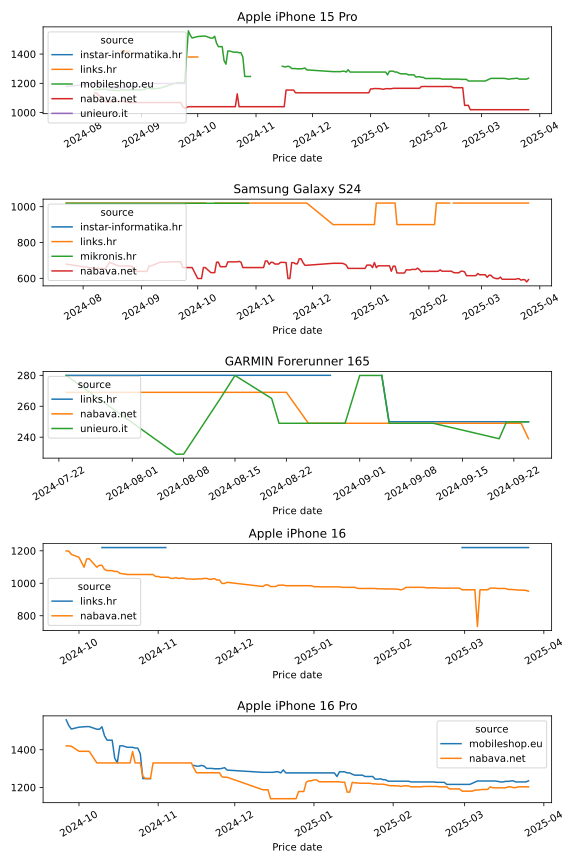

# Price Scraper

Scrapes prices for configured products.

## Installation

Price Scraper is a Python package that is installed and ran via a Command Line. 

Perform the following commands to install the package:

    pip install git+https://github.com/andhrelja/price_scraper
    python -m price_scraper --help


## Usage

    usage: price_scraper [-h] [-i INPUT_CONFIG]

    Scrape pre-configured websites for product prices

    options:
    -h, --help            show this help message and exit
    -i INPUT_CONFIG, --input-config INPUT_CONFIG
                            Products configuration input JSON file path


## Configuration 

> [!IMPORTANT]  
> Supported websites are listed as module names in `price_scraper/services/`:
> - instar
> - links
> - mediaworld
> - mikronis
> - mobileshop
> - nabava
> - unieuro
<!-- https://github.com/orgs/community/discussions/16925 -->

Price Scraper is configured using Environment Variables:

- `LOG_LEVEL`
    - configures logging level, defaults to "DEBUG"
- `PRICE_SCRAPER_IO_OUTPUT`
    - configures the data output path for IO outputs
    - **Note**: type of output is configured by a variable named `Repository` in `price_scraper/__init__.py`

Websites and products to scrape can be configured via `price_scraper/config.json`. Example configuration entry:

```json
{
    "products": [
        {
            "name": "Apple iPhone 15 Pro, 256GB, 6,1\"",
            "short_name": "Apple iPhone 15 Pro",
            "jobs": [
                {
                    "is_active": false,
                    "service": "mediaworld",
                    "protocol": "https://",
                    "host": "mediaworld.it",
                    "port": "",
                    "prefix": "it/product/_apple-iphone-15-pro-256gb-titanio-nero-188294.html",
                    "headers": {
                        "Accept": "text/html,application/xhtml+xml,application/xml;q=0.9,image/webp,image/apng,*/*;q=0.8,application/signed-exchange;v=b3;q=0.7",
                        "Accept-Encoding": "gzip, deflate, br",
                        "Accept-Language": "en-US,en;q=0.9",
                        "User-Agent": "Mozilla/5.0 (Windows NT 10.0; Win64; x64) AppleWebKit/537.36 (KHTML, like Gecko) Chrome/118.0.0.0 Safari/537.36 Edg/118.0.2088.46"
                    }
                }
            ]
        }
    ]
}
```


